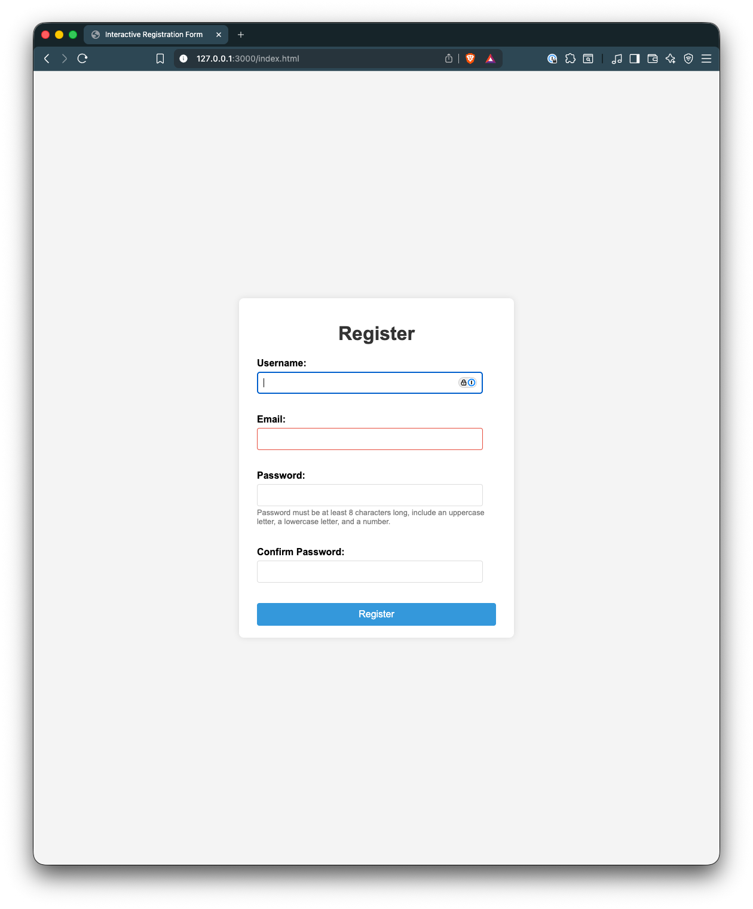

# 🧾 Interactive Registration Form

## 📖 Overview

This project was developed as part of **Lab 6.2: Interactive Registration Form**, focusing on **form validation**, **real-time feedback**, and **data persistence** using **JavaScript**, **HTML5**, and **CSS**.

The application simulates a user registration workflow commonly found in modern web applications. It provides users with instant feedback while filling out the form and retains their username between sessions for convenience.

Users can:

-   Fill out registration fields including **Username**, **Email**, **Password**, and **Confirm Password**.
-   Receive **real-time validation feedback** for incorrect or incomplete input.
-   Prevent invalid form submission through **custom JavaScript validation**.
-   Store and auto-fill the **username** using `localStorage` for returning users.

This lab demonstrates the practical implementation of **front-end validation logic**, **dynamic error handling**, and **local data storage**, combining usability and interactivity to enhance user experience.

---

## 🎯 Objectives

By the end of this lab, you will be able to:

-   Structure a registration form with appropriate HTML elements.
-   Implement **real-time input validation** using JavaScript event listeners.
-   Use **HTML5 validation attributes** (`required`, `type`, `minlength`, `pattern`).
-   Apply **JavaScript validation logic** and custom error messages.
-   Display and clear **dynamic error feedback** next to input fields.
-   Handle form submission using `event.preventDefault()` for custom validation.
-   Store and retrieve form data (username) using **localStorage**.

---

## 🛠️ Technologies Used

-   **HTML5** – Structure and semantic layout
-   **CSS3** – Responsive design and layout utilities
-   **JavaScript (ES6)** – DOM manipulation and event handling
-   **Google Chrome DevTools** – Debugging and testing

---

## 🧩 Project Structure

```
.
├── README.md
├── index.html
├── screenshot
│   └── screenshot.png
├── script.js
└── styles.css
```

---

## 🚀 Live Demo

> 🌐 **Live Demo:** [Click Here for Live Demo](https://structbase.github.io/Interactive-Registration-Form/)

> 💻 **Repository:** [View Source on GitHub](https://github.com/structbase/Interactive-Registration-Form)

---

## 🧪 Testing and Validation

| **Test Case**                   | **Expected Behavior**                                   |
| ------------------------------- | ------------------------------------------------------- |
| Username too short              | Displays "Username must be at least 5 characters long." |
| Invalid email format            | Displays "Please enter a valid email address..."        |
| Weak password                   | Displays message about password requirements            |
| Passwords don’t match           | Displays "Passwords do not match."                      |
| Successful submission           | Button text changes to "Registered!"                    |
| Refresh page after registration | Username pre-fills from localStorage                    |

---

## ⚙️ Edge Cases

-   If `localStorage` is cleared or disabled, username persistence will not work.
-   Form should prevent submission with missing or invalid inputs.
-   Only **non-sensitive** data (like username) should be saved to localStorage — **never passwords**.

---

## 📸 Screenshots

### 🖥️ Desktop Layout



---

## 🪜 How to Run Locally

1. Clone the repository

    ```bash
    git clone <https://github.com/structbase/Interactive-Registration-Form>
    ```

2. Navigate into the project folder

    ```bash
    cd Interactive-Registration-Form
    ```

3. Open the project in your browser

    ```bash
    open index.html
    ```

---


## 🏁 Credits & Resources

-   [MDN Web Docs – Event Propagation](https://developer.mozilla.org/en-US/docs/Learn_web_development/Core/Scripting/Events#event_propagation)
-   [MDN Web Docs – Window: localStorage](https://developer.mozilla.org/en-US/docs/Web/API/Window/localStorage)
-   [Google](https://www.google.com/)

---

## 💭 Reflection Questions

**1. How did `event.preventDefault()` help in handling form submission?**
It stopped the browser from performing its default form submission (page reload), allowing the script to perform custom validation and handle data locally.

**2. What is the difference between using HTML5 validation attributes and JavaScript-based validation?**
HTML5 attributes provide built-in checks and accessibility, while JavaScript allows custom rules, dynamic feedback, and full control over validation messages. Both are often used together for best results.

**3. How did you use `localStorage` to persist and retrieve the username? What are its limitations?**
`localStorage.setItem()` stores the username locally, and `getItem()` retrieves it when the page loads. It’s persistent even after page reloads but is insecure for sensitive data and limited to ~5MB per origin.

**4. What challenge did you face while implementing real-time validation, and how did you solve it?**
Ensuring each input displayed only one clear error message was tricky. Using dedicated `<span>` elements for each field solved layout shifting and made updates cleaner.

**5. How did you ensure that custom error messages were user-friendly?**
Messages were written in plain, concise language and positioned next to their respective inputs, updating immediately when errors were resolved.

---
## ✍️ Author

Developed by **Abenezer**

>  Junior developer 